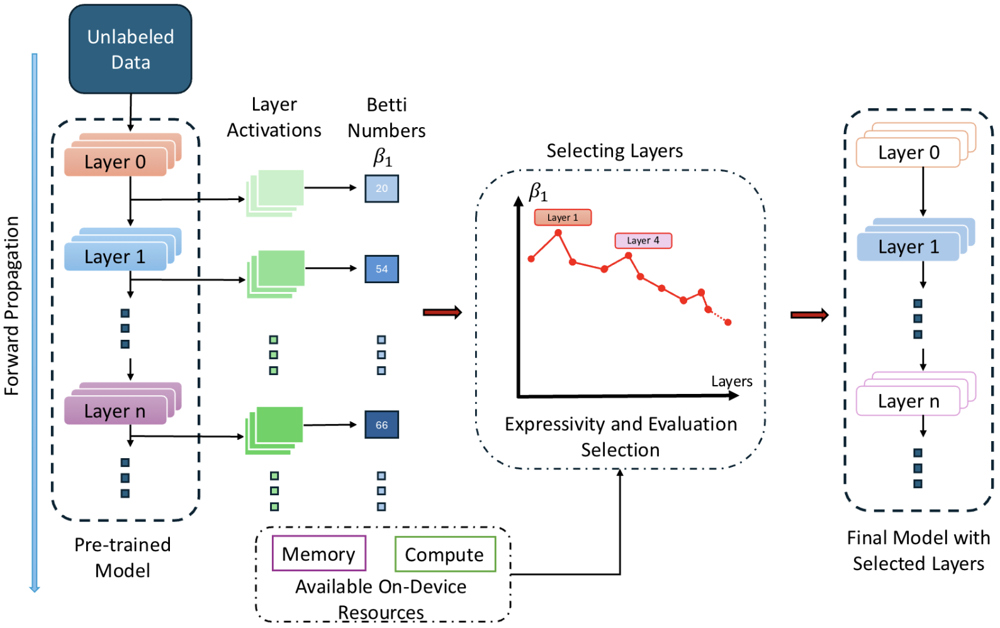

<div id="toc">
   <ul align="center" style="list-style: none;">
  <a href="https://github.com/Nokia-Bell-Labs/efficient_layer_selection"></a>
  <summary>
     <h1>AdaBet</h1> <br>
    <h2>Gradient-free Layer Selection for Efficient Training of Deep Neural Networks</h2>
  </summary>
   </ul>
</div>

## :rocket: Updates
- Oct 8th 2025: The paper is available on [Arxiv](https://arxiv.org/abs/2510.03101).
- Oct 2nd 2025: The code for AdaBet is available on [GitHub](https://github.com/Nokia-Bell-Labs/efficient_layer_selection).

## :book: Summary
To utilize pre-trained neural networks on edge and mobile devices, we often require efficient adaptation to user-specific runtime data distributions while operating under limited compute and memory resources. On-device retraining with a target dataset can facilitate such adaptations; however, it remains impractical due to the increasing depth of modern neural nets, as well as the computational overhead associated with gradient-based optimization across all layers. Current approaches reduce training cost by selecting a subset of layers for retraining, however, they rely on labeled data, at least one full-model backpropagation, or server-side meta-training; limiting their suitability for constrained devices. We introduce AdaBet, a gradient-free layer selection approach to rank important layers by analyzing topological features of their activation spaces through <b>Betti Numbers</b> and using forward passes alone. AdaBet allows selecting layers with high learning capacity, which are important for retraining and adaptation, without requiring labels or gradients. Evaluating AdaBet on sixteen pairs of benchmark models and datasets, shows AdaBet achieves an average gain of 5% more classification accuracy over gradient-based baselines while reducing average peak memory consumption by 40%.

---

The detailed steps of downloading the data and running the framework are summarized as follows. This repository adapts the repository of [ElasticTrainer](https://dl.acm.org/doi/pdf/10.1145/3581791.3596852). We make necessary changes on top of this repository to perform layer selection using Betti numbers. Clone the repo from [here](https://github.com/pittisl/ElasticTrainer) and follow the citation and license requirements accordingly.
## Requirements

Install the dependencies with `pip install -r requirements.txt`

## General Usage

Select NN models, datasets, and rho to run. Use `python main.py --help` to see configurable parameters. The NN architectures and datasets should be downloaded automatically. We use [tensorflow-datasets](https://www.tensorflow.org/datasets/api_docs/python/tfds) API to download datasets from TensorFlow's [dataset list](https://www.tensorflow.org/datasets/catalog/overview#all_datasets). If you encounter any errors (e.g., checksum errors), please refer to [this instruction](https://www.tensorflow.org/datasets/overview#manual_download_if_download_fails) for manual downloading instructions.

### Supported NN architectures:
* ResNet50 -- `resnet50`
* VGG16 -- `vgg16`
* MobileNetV2 -- `mobilenetv2`
* Vision Transformer (16x16 patch) -- `vit`

### Supported datasets:
* [CUB-200](https://www.vision.caltech.edu/datasets/cub_200_2011/) -- `caltech_birds2011` (#classes 200)
* [Oxford-IIIT Pet](https://www.robots.ox.ac.uk/~vgg/data/pets/) -- `oxford_iiit_pet` (#classes 37)
* [Stanford Dogs](http://vision.stanford.edu/aditya86/ImageNetDogs/) -- `stanford_dogs` (#classes 120)
* [Flowers102](https://www.robots.ox.ac.uk/~vgg/data/flowers/102/) -- `flowers102` (#classes 102)

### Running an Example

To start training your model on the device:
```
python main.py --model_name resnet50 \
               --dataset_name oxford_iiit_pet \
               --num_classes 37 \
               --train_type --train_type act_norm_betti_train \
               --rho 0.1
```
### Memory Profiling

The code for measuring the memory profile is provided in `memory_utils.py`. This logic is originally taken from the [TinyTL](https://github.com/mit-han-lab/tinyml/blob/master/tinytl/tinytl/utils/memory_cost_profiler.py) repository and has been adapted to work with TensorFlow. Please follow the citations and license requirements of the [original repository](https://github.com/mit-han-lab/tinyml/tree/master) accordingly.

---
## Citations

If this work, its findings or settings are helpful in your research, please consider citing our paper:

```
@misc{tenison2025adabetgradientfreelayerselection,
      title={AdaBet: Gradient-free Layer Selection for Efficient Training of Deep Neural Networks}, 
      author={Irene Tenison and Soumyajit Chatterjee and Fahim Kawsar and Mohammad Malekzadeh},
      year={2025},
      eprint={2510.03101},
      archivePrefix={arXiv},
      primaryClass={cs.LG},
      url={https://arxiv.org/abs/2510.03101}, 
}
```